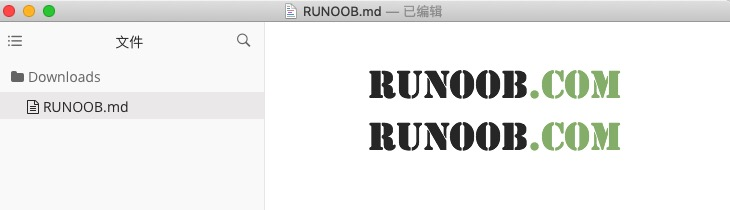
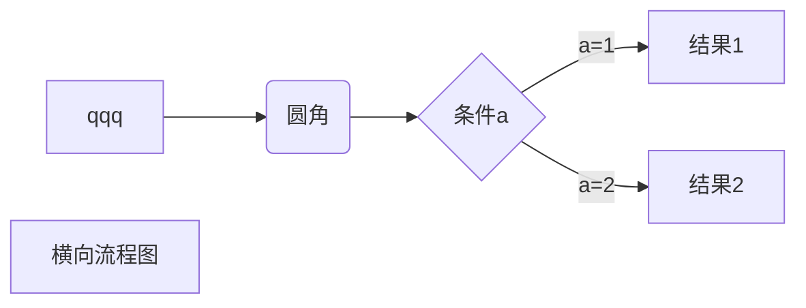
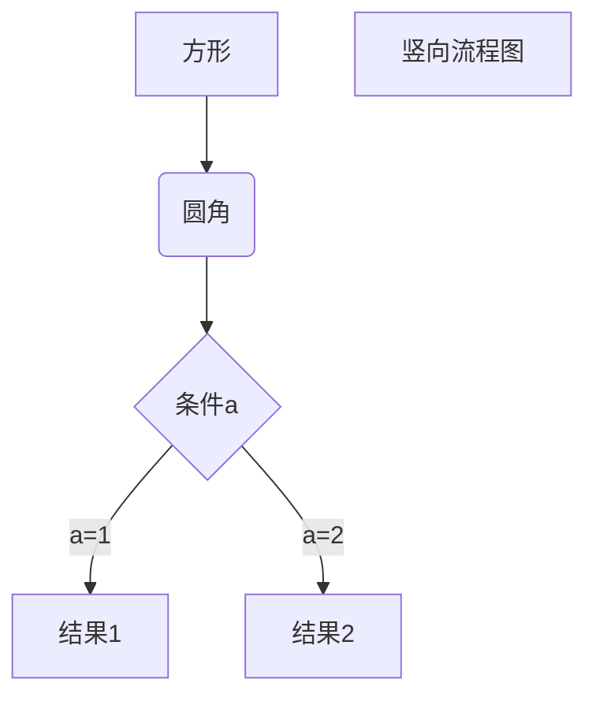
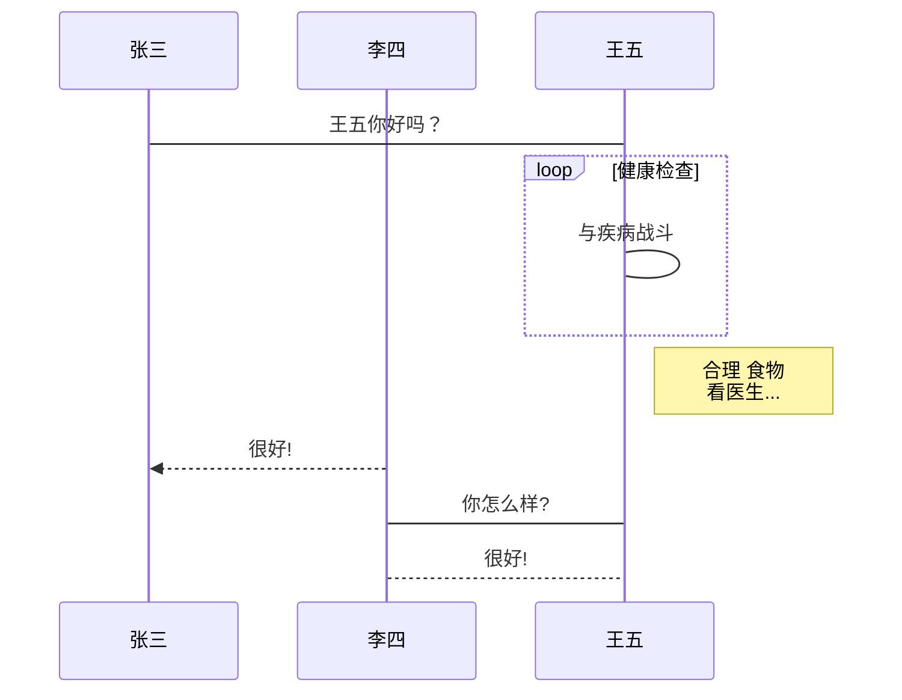

##markdown语法学习
 https://www.runoob.com/markdown/md-advance.html


#day1
```javascript
woshi
```
*wer
1.ddd  
sss    
dffff    
fffff
fffff

*ddd*
_dd_
~~**dddd**~~
***
___
***dddd***

+ sldkd
* ddd

1. dd
   > ff
   > + ff
1. dd


[百度](https://www.baidu.com)
<https://www.baidu.com>




|表头1|表头2|表头1|表头2|
|:---|---:|:---:|---|
|单元格1|单元|
|单元格1|单元格2|单元格1|单元格2|

<b>ddd</b>
<i>fff</i>
<em>ddd</em>






```flow
st=>start: 开始框
op=>operation: 处理框
cond=>condition: 判断框(是或否?)
sub1=>subroutine: 子流程
io=>inputoutput: 输入输出框
e=>end: 结束框
st->op->cond
cond(yes)->io->e
cond(no)->sub1(right)->op
```


```sequence
对象A->对象B: 对象B你好吗?（请求）
Note right of 对象B: 对象B的描述
Note left of 对象A: 对象A的描述(提示)
对象B-->对象A: 我很好(响应)
对象A->对象B: 你真的好吗？
```

```sequence
Title: 标题：复杂使用
对象A->对象B: 对象B你好吗?（请求）
Note right of 对象B: 对象B的描述
Note left of 对象A: 对象A的描述(提示)
对象B-->对象A: 我很好(响应)
对象B->小三: 你好吗
小三-->>对象A: 对象B找我了
对象A->对象B: 你真的好吗？
Note over 小三,对象B: 我们是朋友
participant C
Note right of C: 没人陪我玩
```





